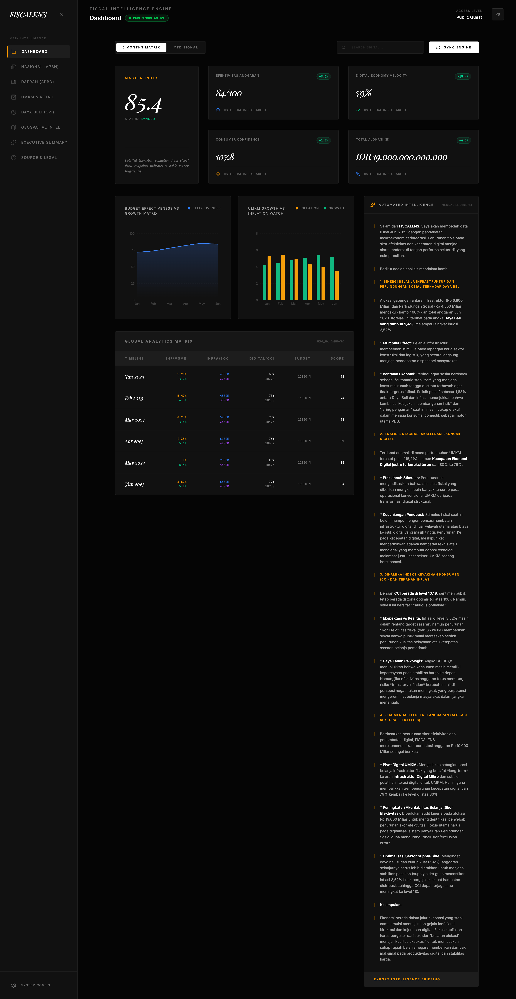

<div align="center">

# 🔭 FISCALENS ANALYTICS
### Intelligence Engine for Indonesia's Fiscal Data



[](https://react.dev/)
[](https://vitejs.dev/)
[](https://www.typescriptlang.org/)
[](https://tailwindcss.com/)
[](https://ai.google.dev/)
[](LICENSE)

> **Transformasi "Raw Data" → "Strategic Insights"** menggunakan kecerdasan buatan Gemini AI untuk analisis fiskal Indonesia secara real-time.

</div>

---

## 📖 Latar Belakang (Background)

**FISCALENS ANALYTICS** adalah platform dashboard intelijen fiskal yang dirancang untuk memberikan visualisasi dan analisis mendalam terhadap data ekonomi makro Indonesia. Di tengah kompleksitas data anggaran (APBN/APBD) dan indikator pasar (Inflasi, UMKM), sistem ini hadir untuk mentransformasi _Raw Data_ menjadi _Strategic Insights_ menggunakan teknologi kecerdasan buatan **Gemini AI**.

Platform ini mengusung estetika **Brutalist-Minimalist** dengan nuansa **dark-mode** untuk fokus maksimal pada akurasi data dan kecepatan transmisi informasi.

---

## ✨ Fitur Utama (Core Features)

### 📊 A. Dashboard Real-Time
| Fitur | Deskripsi |
| :--- | :--- |
| 🗓️ **6-Month Matrix Tracking** | Pemantauan indikator ekonomi selama 6 bulan terakhir |
| 📈 **Dynamic KPI Cards** | Metrik indeks digital, kepercayaan konsumen, dan alokasi anggaran |
| 📉 **Integrated Charting** | Visualisasi korelasi inflasi & pertambahan UMKM via D3-powered charts |

### 🗂️ B. Segmentasi Data Analitik
| Segmen | Fokus |
| :--- | :--- |
| 🏛️ **Nasional (APBN)** | Distribusi anggaran pusat |
| 🗺️ **Daerah (APBD)** | Sinkronisasi fiskal antar wilayah |
| 🏪 **UMKM & Retail** | Velocity ekonomi digital di sektor mikro |
| 🛒 **Daya Beli (CPI)** | Fluktuasi indeks harga konsumen & daya serap pasar |

### 🌏 C. Geospatial Intelligence
- 🗾 **3D-Projected Mapping** — Visualisasi spasial sebaran efisiensi fiskal di 5 pulau besar (Sumatera, Jawa, Kalimantan, Sulawesi, Papua).
- 📡 **Regional Signal Mapping** — Analisis perbedaan kecepatan ekonomi digital antar region.

### 🤖 D. AI Executive Summary
- 🧠 **Gemini Neural Engine** — Regresi data otomatis berbasis AI.
- 📋 **Automated Intelligence Briefing** — Kesimpulan strategis secara _Live_ berdasarkan data aktif.
- 🔍 **Structural Findings** — Analisis multiplier fiskal dan korelasi pasar secara instan.

---

## 🛠️ Tech Stack

<div align="center">

| Komponen | Teknologi | Versi |
| :---: | :---: | :---: |
| ⚛️ **Framework** | React (Vite) | `19+` |
| 🎨 **Styling** | Tailwind CSS | `4.x` |
| 🔷 **Language** | TypeScript | `5.8` |
| 🎞️ **Animations** | Framer Motion | `12.x` |
| 📊 **Data Viz** | Recharts | `3.x` |
| 🤖 **Intelligence** | Gemini AI SDK | `1.x` |
| 🔣 **Icons** | Lucide React | `0.5+` |

</div>

---

## 🏗️ Arsitektur Data

```
Client Browser
     │
     ▼
┌─────────────────────────┐
│  Client-Side Fetch &    │
│  Normalization Layer    │
│  (api.service.ts)       │
└────────────┬────────────┘
             │
     ┌───────┴────────┐
     ▼                ▼
┌─────────┐     ┌───────────┐
│   BPS   │     │  Kemenkeu │
│  Data   │     │ Open Data │
└─────────┘     └───────────┘
```

Sistem menggunakan strategi **Client-Side Fetch & Normalization**. Data dikonfigurasi melalui `api.service.ts` yang mensimulasikan normalisasi dari endpoint BPS (Badan Pusat Statistik) dan Open Data Kemenkeu.

---

## 🔓 Akses Publik

> ✅ Aplikasi telah dikonfigurasi untuk **Public Guest Access**.

Tidak memerlukan autentikasi khusus (SSO/OAuth) untuk navigasi publik, memungkinkan akses cepat ke node-node intelijen bagi seluruh **stakeholder ekonomi Indonesia**.

---

## 🚀 Cara Menjalankan (Getting Started)

```bash
# 1. Clone repository
git clone https://github.com/nandasafiqalfiansyah/Fiscalens.git
cd Fiscalens

# 2. Install dependencies
npm install

# 3. Salin file environment
cp .env.example .env
# Isi GEMINI_API_KEY di file .env

# 4. Jalankan development server
npm run dev
```

Akses aplikasi di: **http://localhost:3000**

---

<div align="center">

**FISCALENS © 2024** — *Automated Fiscal Intelligence for National Growth* 🇮🇩

Made with ❤️ for Indonesia's Economic Transparency

</div>
